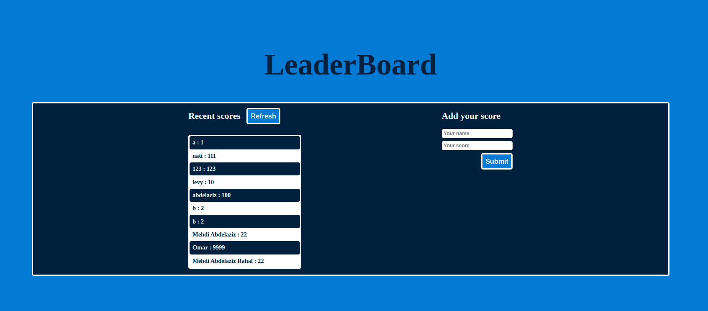

# Leaderboard

> One paragraph statement about the project.

Additional description about the project and its features.

## Built With

- HTML
- CSS
- Javascript
- Webpack

## Live Demo

[Live Demo Link](https://livedemo.com)

## Getting Started

To get a local copy up and running follow these simple example steps.

### Prerequisites
- Clone the GitHub Repository
- run this commands in your terminal:

### Setup

- npm install
- npm run build
- npm start

### Usage
after running npm start the website will be opened automatically on your default browser.

## Authors

👤 **Mehdi Rahal**

- GitHub: [@Mehdi-Rh](https://github.com/Mehdi-Rh)
- Twitter: [@MRahal92](https://twitter.com/MRahal92)
- LinkedIn: [mehdi-rahal22](https://www.linkedin.com/in/mehdi-rahal22/)

## 🤝 Contributing

Contributions, issues, and feature requests are welcome!

Feel free to check the [issues page](https://github.com/Mehdi-Rh/Leaderboard/issues).

## Show your support

Give a ⭐️ if you like this project!

## Acknowledgments

Microverse offered guidance on how to make the project more professional

## 📝 License

This project is [MIT](./MIT.md) licensed.
